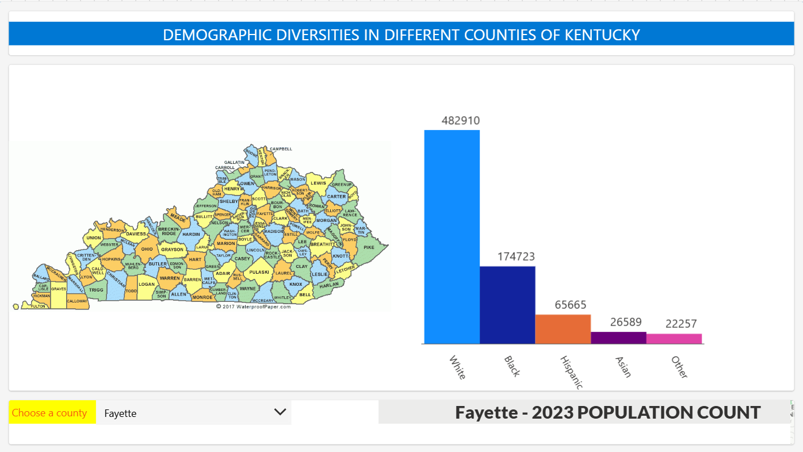

### KY Countywise Demographic Diversity Information - 2023

## Table of Contents
- [Introduction](#introduction)
- [Functionalities](#functionalities)
- [Data Model](#data-model)
- [User Interface Development](#user-interface-development)
- [Challenges](#challenges)
- [Potential Improvements](#potential-improvements)
- [Conclusion](#conclusion)

---

## Introduction
This app visualizes the population distribution of different ethnic groups in various counties of Kentucky based on 2023 data. The demographic data is obtained from the official [data source](http://ksdc.louisville.edu/data-downloads/estimates/).

---

## Functionalities
- For a selected county in Kentucky, the app displays the population count of various ethnicities (White, Black, Hispanic, Asian, and Other) in a bar/column chart.
- The app shows the exact population count at the top of each bar for better readability.
- A map is also presented to help users reference the counties of Kentucky.

---

## Data Model
- After processing multiple sheets from Excel files, a **Comma-Separated Values (.csv)** file is created using Python and the scientific library **Pandas**.
- The CSV file is then uploaded, and a data table is created in the Power App dashboard.

---

## User Interface Development
- In the dashboard, users input the county name.
- The program selects data based on the chosen county and generates a bar/column chart.  

---

## Challenges
- Filtering the data took a significant amount of time.
- Understanding the behavior of different container components and adjusting them for the desired outcome was also challenging.

---

## Potential Improvements
- The app can be extended to incorporate additional demographic data across multiple years.

---

## Conclusion
- The skills and concepts gained from developing this app can be easily transferred to laboratory scenarios. With necessary modifications, this approach can be applied to various use cases, such as tracking the use of chemicals over time, monitoring microbial growth in labs, and analyzing the diversity of students across different laboratories.
